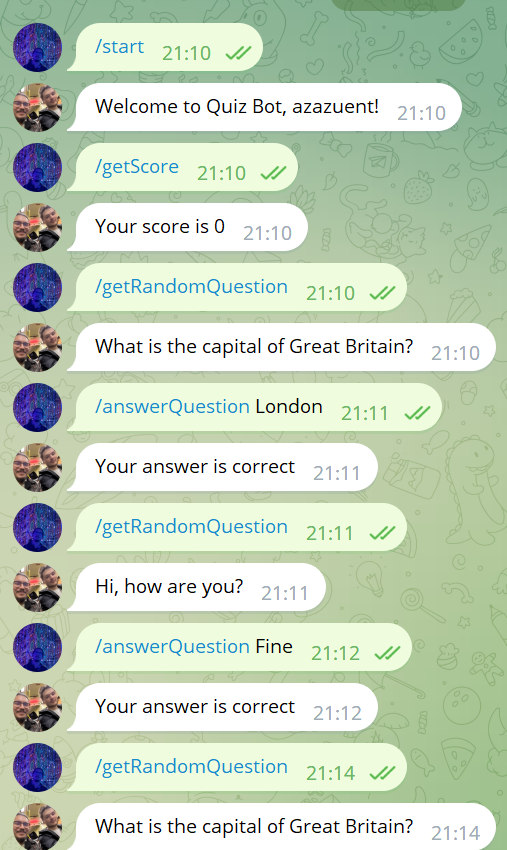
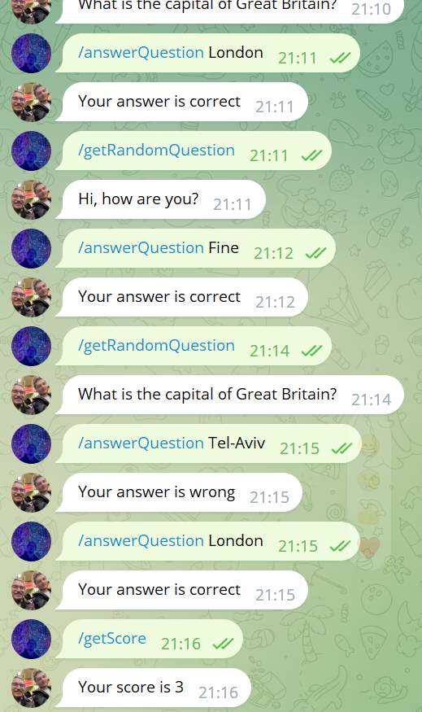

# QuizBot
QuizBot using Java Spring JPA

Квиз-бот Telegram. Полностью реализован требуемый функционал. Ну, кроме таймера(.

# Функционал

## Пункт 1
/start - регистрация.

## Пункт 2
Авторизация производится по ID чата.

## Пункт 3
/add - добавление вопроса.

После первого использования /add, используются /addBody, /addAnswer, /addTag для формирования вопроса.

После того, как вопрос сформирован, команда /add добавляет его в систему.

Ответ обрабатывается если была отправлена строка без команды, всегда считается, что пользователь отвечает на последний запрошенный вопрос, на который еще не ответил.

## Пункт 4
Get /question <tag> - получение случайного вопроса, при указании тега - вопрос, относящийся к нему.

## Пункт 5
Get /score <tag> - получение счета пользователя, при указании тега - только по вопросам из указанной категории.

Post /reset - обнуление счета пользователя.

Было интересно.

Ниже скриншоты работы бота.

<<<<<<< HEAD
Полоумный код и рефакторинг, пока не удалось реализовать получение вопроса или счета сразу по нескольким тегам, но корректно работает привязка нескольких тегов к одному вопросу и все с этим связанное. Также, привязывать теги к вопросам нужно поочередно и отдельными запросами.
Есть над чем работать, было интересно.

=======
>>>>>>> 9a33549f676e31a08a7795c981854dc43214369d
